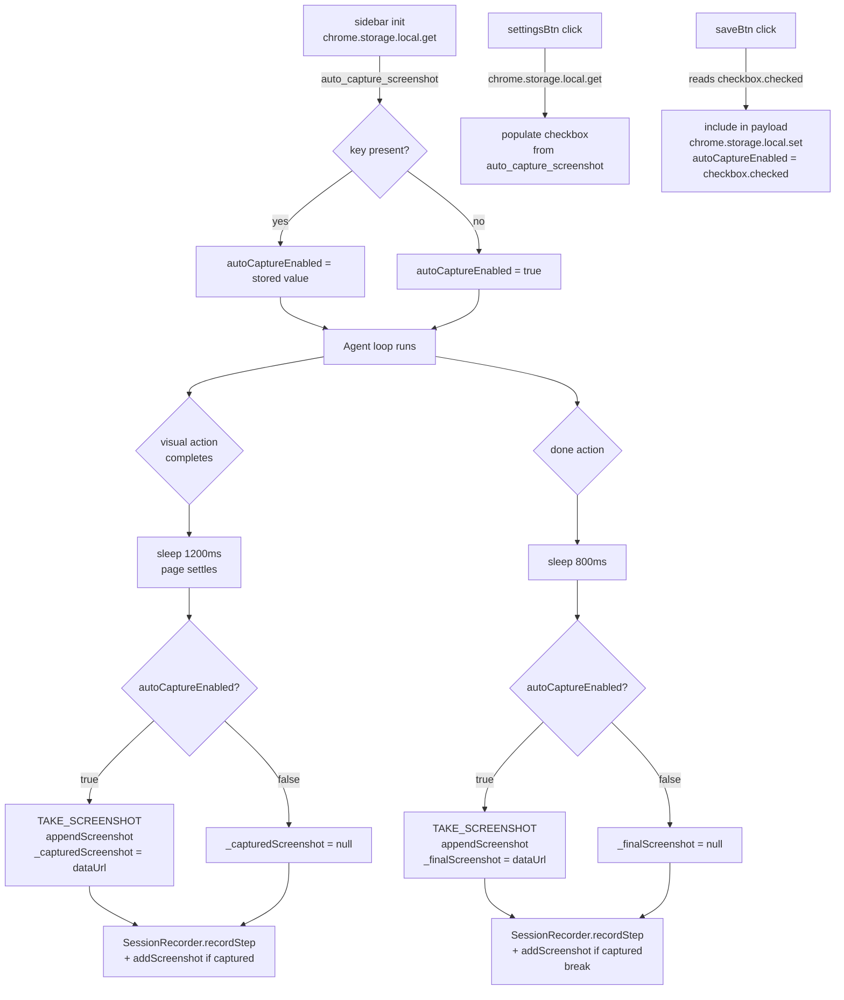

# Design Document — Auto Capture Screenshot Setting

## Overview

This feature adds a user-configurable boolean toggle that controls whether the Mini Browser Agent automatically captures screenshots during agent loop execution. The setting is persisted in `chrome.storage.local`, exposed as a checkbox in the existing Settings screen, and read into a single module-level variable (`autoCaptureEnabled`) at sidebar startup. The agent loop checks that variable synchronously on every step — no storage I/O per step.

The default value is `true`, so existing users see no behavior change. When disabled, the agent skips all automatic screenshot captures (both after visual actions and after the `done` action) while still recording every step in `SessionRecorder` with a `null` screenshot value.

The manual screenshot toolbar button (`#screenshot-btn`) is entirely unaffected by this setting.

---

## Architecture

The change is confined to three files:

```
sidebar.html   — adds the checkbox row to the settings form
sidebar.css    — adds styling for the checkbox row
sidebar.js     — adds state variable, storage read/write, and conditional guards
```

No new modules, no new message types to `background.js`, no changes to `SessionRecorder`, `PromptEngine`, or any tool file.



---

## Components and Interfaces

### 1. Module-level state variable — `sidebar.js`

```javascript
let autoCaptureEnabled = true;   // default; overwritten by storage read at init
```

Added alongside the existing state variables (`conversationHistory`, `isLoading`, etc.).

### 2. Init block — `sidebar.js`

The existing `chrome.storage.local.get` call gains `"auto_capture_screenshot"` in its key list:

```javascript
chrome.storage.local.get(
  ["selected_provider", "minimax_api_key", "minimax_model",
   "agent_mode", "custom_instructions", "auto_capture_screenshot"],
  (data) => {
    if (chrome.runtime.lastError) {
      console.error("[Sidebar] Storage read error:", chrome.runtime.lastError.message);
      // autoCaptureEnabled stays true (default)
    } else {
      autoCaptureEnabled = data.auto_capture_screenshot !== false;
      // `!== false` means: absent key → true, true → true, false → false
    }
    // ... rest of existing init logic unchanged
  }
);
```

### 3. Settings form — `sidebar.html`

A new `.input-group` row is inserted between the model select and the Save button:

```html
<div class="input-group input-group--inline">
  <label for="auto-capture-checkbox">Auto Capture Screenshots</label>
  <input type="checkbox" id="auto-capture-checkbox" checked />
</div>
```

The `checked` attribute sets the visual default; the actual value is always overwritten when the settings screen opens.

### 4. `saveBtn` handler — `sidebar.js`

Reads the checkbox and includes it in the storage payload:

```javascript
const autoCaptureCheckbox = document.getElementById("auto-capture-checkbox");
const payload = { selected_provider: provider };
if (provider === "minimax") {
  payload.minimax_api_key = key;
  payload.minimax_model   = model;
}
payload.auto_capture_screenshot = autoCaptureCheckbox ? autoCaptureCheckbox.checked : true;

chrome.storage.local.set(payload, () => {
  // update in-memory variable immediately
  autoCaptureEnabled = payload.auto_capture_screenshot;
  showChatScreen(model);
});
```

### 5. `settingsBtn` handler — `sidebar.js`

Reads the stored value and populates the checkbox when the settings screen opens:

```javascript
chrome.storage.local.get(
  ["selected_provider", "minimax_api_key", "minimax_model", "auto_capture_screenshot"],
  (data) => {
    // ... existing field population ...
    const autoCaptureCheckbox = document.getElementById("auto-capture-checkbox");
    if (autoCaptureCheckbox) {
      autoCaptureCheckbox.checked = data.auto_capture_screenshot !== false;
    }
  }
);
```

### 6. Visual action screenshot block — `sidebar.js` (`runAgentLoop`)

The 1200 ms sleep stays unconditional (page must settle regardless). Only the screenshot capture and `appendScreenshot` call are wrapped:

```javascript
// Before (existing):
if (visualActions.includes(action.type)) {
  await sleep(1200);
  const ssRes = await sendToBackground({ type: "TAKE_SCREENSHOT" });
  if (ssRes.success) {
    appendScreenshot(ssRes.dataUrl);
    _capturedScreenshot = ssRes.dataUrl;
  }
}

// After:
if (visualActions.includes(action.type)) {
  await sleep(1200);                          // always — page needs to settle
  if (autoCaptureEnabled) {
    const ssRes = await sendToBackground({ type: "TAKE_SCREENSHOT" });
    if (ssRes.success) {
      appendScreenshot(ssRes.dataUrl);
      _capturedScreenshot = ssRes.dataUrl;
    }
  }
}
```

`_capturedScreenshot` remains `null` when capture is skipped, so the `SessionRecorder.addScreenshot` call below is naturally skipped (it is already guarded by `if (_capturedScreenshot)`).

### 7. Done action screenshot block — `sidebar.js` (`runAgentLoop`)

Same pattern — sleep stays unconditional, capture is wrapped:

```javascript
// Before (existing):
await sleep(800);
try {
  const ssRes = await sendToBackground({ type: "TAKE_SCREENSHOT" });
  if (ssRes && ssRes.success) {
    appendScreenshot(ssRes.dataUrl);
    _finalScreenshot = ssRes.dataUrl;
  }
} catch (e) { console.warn("Failed to capture final screenshot", e); }

// After:
await sleep(800);
if (autoCaptureEnabled) {
  try {
    const ssRes = await sendToBackground({ type: "TAKE_SCREENSHOT" });
    if (ssRes && ssRes.success) {
      appendScreenshot(ssRes.dataUrl);
      _finalScreenshot = ssRes.dataUrl;
    }
  } catch (e) { console.warn("Failed to capture final screenshot", e); }
}
```

`_finalScreenshot` remains `null` when skipped; the existing `if (_finalScreenshot) SessionRecorder.addScreenshot(...)` guard handles it correctly.

### 8. CSS — `sidebar.css`

An inline variant of `.input-group` for the checkbox row:

```css
.input-group--inline {
  flex-direction: row;
  align-items: center;
  justify-content: space-between;
}

.input-group--inline input[type="checkbox"] {
  width: 16px;
  height: 16px;
  accent-color: var(--accent);
  cursor: pointer;
  flex-shrink: 0;
}
```

---

## Data Models

### `chrome.storage.local` schema (additions)

| Key | Type | Default (absent) | Description |
|-----|------|-----------------|-------------|
| `auto_capture_screenshot` | `boolean` | `true` | Whether the agent loop automatically captures screenshots after visual actions and the done action. |

The key is written alongside `selected_provider`, `minimax_api_key`, and `minimax_model` in the `saveBtn` handler. It is read in the init block and the `settingsBtn` handler.

### In-memory state

| Variable | Type | Initial value | Updated by |
|----------|------|--------------|-----------|
| `autoCaptureEnabled` | `boolean` | `true` | Init block (from storage), `saveBtn` handler (from checkbox) |

---

## Correctness Properties

*A property is a characteristic or behavior that should hold true across all valid executions of a system — essentially, a formal statement about what the system should do. Properties serve as the bridge between human-readable specifications and machine-verifiable correctness guarantees.*

This feature is a simple conditional flag over a small, well-defined input space (boolean values, a fixed set of visual action types). Property-based testing is applicable for the storage round-trip and the agent-loop conditional behavior, where input variation (different boolean values, different action types) meaningfully exercises the logic.

---

### Property 1: Storage round-trip

*For any* boolean value written to `chrome.storage.local` as `auto_capture_screenshot` via the save handler, reading the key back from storage must return the same boolean value.

**Validates: Requirements 1.1, 1.3, 2.3**

---

### Property 2: Init loads stored value into autoCaptureEnabled

*For any* boolean value stored under `auto_capture_screenshot` in `chrome.storage.local`, after the sidebar init block executes, `autoCaptureEnabled` must equal that stored value.

**Validates: Requirements 1.4, 6.2**

---

### Property 3: Settings screen reflects stored value

*For any* boolean value stored under `auto_capture_screenshot`, when the settings screen is opened (via the settingsBtn handler), the `#auto-capture-checkbox` element's `checked` property must equal the stored value.

**Validates: Requirements 2.2, 2.4**

---

### Property 4: Visual action with autoCaptureEnabled=true triggers screenshot

*For any* action type in the `visualActions` array (`navigate`, `click`, `fill_input`, `scroll`, `new_tab`, `hover`, `select_option`, `scroll_to`), when `autoCaptureEnabled` is `true`, the agent loop must send a `TAKE_SCREENSHOT` message to the background after the action completes.

**Validates: Requirements 3.1, 7.1**

---

### Property 5: Visual action with autoCaptureEnabled=false skips screenshot

*For any* action type in the `visualActions` array, when `autoCaptureEnabled` is `false`, the agent loop must NOT send a `TAKE_SCREENSHOT` message to the background after the action completes.

**Validates: Requirements 3.2**

---

### Property 6: Step is always recorded regardless of autoCaptureEnabled

*For any* visual action type and *any* value of `autoCaptureEnabled`, `SessionRecorder.recordStep` must be called exactly once after the action completes. `SessionRecorder.addScreenshot` must be called if and only if `autoCaptureEnabled` is `true` and the screenshot succeeded.

**Validates: Requirements 3.4, 7.4**

---

### Property 7: Save updates both storage and in-memory state atomically

*For any* boolean value set on the `#auto-capture-checkbox` before clicking Save, after the save handler completes, both `chrome.storage.local` and the in-memory `autoCaptureEnabled` variable must reflect that same boolean value.

**Validates: Requirements 6.3**

---

## Error Handling

| Scenario | Behavior |
|----------|----------|
| `chrome.storage.local.get` fails at init | `autoCaptureEnabled` stays `true`; error logged via `console.error`; no disruption to agent loop |
| `chrome.storage.local.set` fails in saveBtn | Existing error handling in saveBtn applies; `autoCaptureEnabled` is still updated in memory (the in-memory update happens in the `set` callback, so if `set` fails the callback is not called — `autoCaptureEnabled` retains its previous value, which is safe) |
| `#auto-capture-checkbox` element not found | Both `saveBtn` and `settingsBtn` handlers guard with a null check; defaults to `true` |
| `TAKE_SCREENSHOT` fails when autoCaptureEnabled=true | Existing error handling applies (the `if (ssRes.success)` guard); `_capturedScreenshot` stays `null`; step is still recorded |

---

## Testing Strategy

### Unit tests (example-based)

These cover specific scenarios and edge cases that are not worth running 100+ times:

- **Default value**: With empty storage, `autoCaptureEnabled` initializes to `true`
- **Storage read failure**: When `chrome.storage.local.get` errors, `autoCaptureEnabled` stays `true` and `console.error` is called
- **Done action, flag=true**: `TAKE_SCREENSHOT` is sent after the `done` action
- **Done action, flag=false**: `TAKE_SCREENSHOT` is NOT sent after the `done` action; `SessionRecorder.recordStep` is still called
- **Manual screenshot button**: With `autoCaptureEnabled=false`, clicking `#screenshot-btn` still sends `TAKE_SCREENSHOT`
- **Sleep is unconditional**: With `autoCaptureEnabled=false`, `sleep(1200)` is still called after a visual action
- **Existing settings fields unaffected**: After adding the checkbox, `#provider-select`, `#api-key-input`, `#model-select`, and `#save-btn` still exist in the DOM

### Property-based tests

Using [fast-check](https://github.com/dubzzz/fast-check) (already consistent with the project's JS ecosystem). Each test runs a minimum of 100 iterations.

| Property | Generator | Assertion |
|----------|-----------|-----------|
| P1: Storage round-trip | `fc.boolean()` | `stored value === written value` |
| P2: Init loads stored value | `fc.boolean()` | `autoCaptureEnabled === stored value` |
| P3: Settings screen reflects stored value | `fc.boolean()` | `checkbox.checked === stored value` |
| P4: Visual action + flag=true → screenshot sent | `fc.constantFrom(...visualActions)` | `TAKE_SCREENSHOT` message sent |
| P5: Visual action + flag=false → screenshot skipped | `fc.constantFrom(...visualActions)` | `TAKE_SCREENSHOT` message NOT sent |
| P6: Step always recorded | `fc.tuple(fc.constantFrom(...visualActions), fc.boolean())` | `recordStep` called once; `addScreenshot` called iff flag=true and screenshot succeeded |
| P7: Save updates storage and memory | `fc.boolean()` | both storage and `autoCaptureEnabled` equal checkbox value |

Tag format for each test: `// Feature: auto-capture-setting, Property N: <property text>`

### What is NOT tested

- The 1200 ms / 800 ms sleep durations (timing behavior, not logic)
- Visual appearance of the checkbox in the dark theme (manual review)
- Keyboard accessibility of the native checkbox (guaranteed by the browser for `<input type="checkbox">`)
