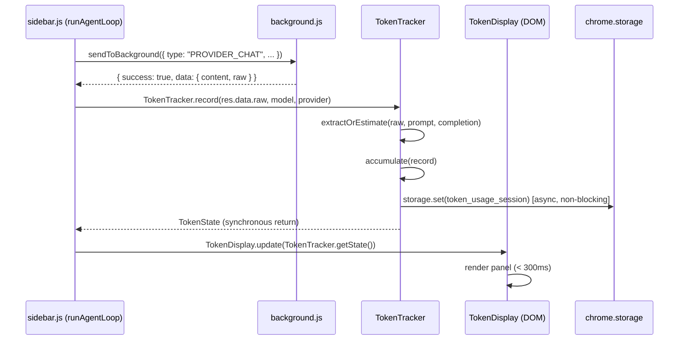

# Design Document — Realtime Token Usage Summary

## Overview

Fitur ini menambahkan modul `TokenTracker` dan komponen UI `TokenDisplay` ke dalam Chrome Extension Mini Browser Agent. Setiap kali `sidebar.js` menerima respons dari `PROVIDER_CHAT`, data token diekstrak dari field `usage` pada respons (atau diestimasi dari panjang karakter jika field tidak tersedia), diakumulasikan per sesi, dan ditampilkan secara realtime di panel ringkasan yang muncul di bawah header sidebar.

Desain ini mengutamakan tiga prinsip:
1. **Non-disruptif** — tidak mengubah alur agent loop yang sudah ada.
2. **Fail-safe** — error di dalam token tracking tidak boleh menghentikan agent.
3. **Ringan** — tidak ada dependensi eksternal baru; semua logika berjalan di dalam extension context.

---

## Architecture

### Komponen Baru

```
token-tracker.js          ← Modul baru: logika tracking, akumulasi, kalkulasi biaya
sidebar.js (modifikasi)   ← Integrasi: panggil TokenTracker setelah setiap PROVIDER_CHAT
sidebar.html (modifikasi) ← Tambah elemen #token-display-panel
sidebar.css (modifikasi)  ← Tambah style untuk panel token
```

### Alur Data



### Titik Integrasi di `sidebar.js`

Integrasi dilakukan di satu titik tunggal di dalam `runAgentLoop`, tepat setelah baris:

```javascript
const reply = res.data?.content || "No response.";
```

Kode yang ditambahkan:

```javascript
// Token tracking — non-disruptif, wrapped dalam try/catch
try {
  const tokenState = TokenTracker.record({
    raw: res.data?.raw,
    model: model,
    provider: provider,
    promptMessages: apiMessages,
    completionText: reply
  });
  TokenDisplay.update(tokenState);
} catch (e) {
  console.warn("[TokenTracker] Error:", e);
  // Tidak melempar exception — agent loop tetap berjalan
}
```

---

## Components and Interfaces

### `TokenTracker` (token-tracker.js)

Module singleton yang di-expose ke `window.TokenTracker`.

```javascript
/**
 * @typedef {Object} ApiCallRecord
 * @property {number} ts              - Unix timestamp (ms)
 * @property {string} model           - Nama model (e.g. "MiniMax-M2.7")
 * @property {string} provider        - Nama provider (e.g. "minimax")
 * @property {number} promptTokens    - Token input
 * @property {number} completionTokens - Token output
 * @property {number} totalTokens     - promptTokens + completionTokens
 * @property {number} costUsd         - Estimasi biaya dalam USD
 * @property {boolean} isEstimated    - true jika token dihitung via estimasi karakter
 */

/**
 * @typedef {Object} TokenState
 * @property {number} cumulativePromptTokens
 * @property {number} cumulativeCompletionTokens
 * @property {number} cumulativeTotalTokens
 * @property {number} cumulativeCostUsd
 * @property {number} callCount
 * @property {ApiCallRecord|null} lastCall
 * @property {boolean} hasEstimatedCalls - true jika ada panggilan yang menggunakan estimasi
 */

const TokenTracker = {
  /**
   * Catat satu API call dan akumulasikan ke state sesi.
   * @param {{ raw: object, model: string, provider: string, promptMessages: array, completionText: string }} opts
   * @returns {TokenState}
   */
  record(opts): TokenState,

  /** Reset semua akumulasi ke nol dan hapus dari storage. */
  reset(): void,

  /** Kembalikan state sesi saat ini (immutable copy). */
  getState(): TokenState,

  /** Set indikator loading (digunakan oleh TokenDisplay). */
  setLoading(active: boolean): void,

  /** Kembalikan apakah sedang dalam state loading. */
  isLoading(): boolean,

  /** Restore state dari storage (dipanggil saat init). */
  async loadFromStorage(): Promise<void>
};
```

#### Sub-fungsi Internal

```javascript
// Ekstrak token dari field `usage` pada raw response
function _extractFromUsage(raw): { promptTokens, completionTokens, totalTokens, isEstimated: false } | null

// Estimasi token dari panjang karakter (ceil(chars / 4))
function _estimateTokens(text): number

// Hitung biaya berdasarkan Pricing_Config
function _calculateCost(promptTokens, completionTokens, model): number

// Format angka token dengan pemisah ribuan
function _formatTokenCount(n): string   // e.g. "1,234"

// Format biaya dalam USD
function _formatCost(usd): string       // e.g. "$0.03"
```

### `TokenDisplay` (bagian dari token-tracker.js)

Objek yang mengelola rendering panel di DOM.

```javascript
const TokenDisplay = {
  /**
   * Perbarui panel dengan state terbaru.
   * @param {TokenState} state
   */
  update(state: TokenState): void,

  /** Tampilkan/sembunyikan indikator loading. */
  setLoading(active: boolean): void,

  /** Inisialisasi — inject elemen panel ke DOM. */
  init(): void
};
```

### Pricing Config

```javascript
const PRICING_CONFIG = {
  "MiniMax-M2.7":     { inputPer1k: 0.0008, outputPer1k: 0.0008 },
  "MiniMax-M2.7-Pro": { inputPer1k: 0.0016, outputPer1k: 0.0016 },
  "MiniMax-M2.5":     { inputPer1k: 0.0004, outputPer1k: 0.0004 },
  "MiniMax-M2.5-Pro": { inputPer1k: 0.0008, outputPer1k: 0.0008 }
};

const DEFAULT_PRICING_MODEL = "MiniMax-M2.7";
```

> Harga bersifat estimasi dan dapat diperbarui. Struktur `PRICING_CONFIG` dirancang agar provider baru dapat ditambahkan tanpa mengubah logika kalkulasi inti.

---

## Data Models

### `TokenState` (in-memory)

```javascript
{
  cumulativePromptTokens:     0,   // number
  cumulativeCompletionTokens: 0,   // number
  cumulativeTotalTokens:      0,   // number
  cumulativeCostUsd:          0.0, // number
  callCount:                  0,   // number
  lastCall:                   null, // ApiCallRecord | null
  hasEstimatedCalls:          false // boolean
}
```

### `ApiCallRecord`

```javascript
{
  ts:                 1700000000000, // number (Date.now())
  model:              "MiniMax-M2.7",
  provider:           "minimax",
  promptTokens:       512,
  completionTokens:   128,
  totalTokens:        640,
  costUsd:            0.000512,
  isEstimated:        false
}
```

### Storage Schema (`chrome.storage.session` / `chrome.storage.local`)

Key: `token_usage_session`

```javascript
{
  cumulativePromptTokens:     512,
  cumulativeCompletionTokens: 128,
  cumulativeTotalTokens:      640,
  cumulativeCostUsd:          0.000512,
  callCount:                  1,
  hasEstimatedCalls:          false,
  lastCall: {
    ts:               1700000000000,
    model:            "MiniMax-M2.7",
    provider:         "minimax",
    promptTokens:     512,
    completionTokens: 128,
    totalTokens:      640,
    costUsd:          0.000512,
    isEstimated:      false
  }
}
```

### HTML Panel Structure

```html
<!-- Disisipkan di sidebar.html, di antara #highlight-toast dan #task-progress -->
<div id="token-display-panel" class="token-panel hidden" aria-live="polite" aria-label="Token usage summary" role="status">
  <div class="token-panel-inner">
    <span class="token-label">Tokens</span>
    <span class="token-loading hidden" aria-hidden="true">⏳</span>
    <span class="token-cumulative" id="token-cumulative">0</span>
    <span class="token-breakdown" id="token-breakdown">↑0 ↓0</span>
    <span class="token-calls" id="token-calls">0 calls</span>
    <span class="token-cost" id="token-cost">$0.00</span>
    <span class="token-last" id="token-last" title="Last call tokens"></span>
  </div>
</div>
```

---

## Correctness Properties

*A property is a characteristic or behavior that should hold true across all valid executions of a system — essentially, a formal statement about what the system should do. Properties serve as the bridge between human-readable specifications and machine-verifiable correctness guarantees.*

### Property 1: Ekstraksi token dari `usage` adalah identitas

*For any* raw API response object yang memiliki field `usage.prompt_tokens`, `usage.completion_tokens`, dan `usage.total_tokens`, hasil ekstraksi TokenTracker harus mengembalikan nilai yang identik dengan nilai di dalam field tersebut.

**Validates: Requirements 1.1**

---

### Property 2: Estimasi token berbasis karakter mengikuti formula ceil(n/4)

*For any* string dengan panjang `n` karakter, `_estimateTokens(s)` harus mengembalikan `Math.ceil(n / 4)`.

**Validates: Requirements 1.2**

---

### Property 3: Akumulasi token adalah jumlah dari semua panggilan

*For any* urutan `k` API call records dengan nilai `totalTokens[i]`, `promptTokens[i]`, `completionTokens[i]`, setelah semua record diproses:
- `state.cumulativeTotalTokens === sum(totalTokens[i])`
- `state.cumulativePromptTokens === sum(promptTokens[i])`
- `state.cumulativeCompletionTokens === sum(completionTokens[i])`
- `state.callCount === k`

**Validates: Requirements 2.1, 2.2, 2.3**

---

### Property 4: Reset mengembalikan semua akumulasi ke nol

*For any* urutan API call records (termasuk urutan kosong), setelah `TokenTracker.reset()` dipanggil, semua nilai kumulatif harus bernilai nol: `cumulativeTotalTokens === 0`, `cumulativePromptTokens === 0`, `cumulativeCompletionTokens === 0`, `cumulativeCostUsd === 0`, `callCount === 0`, `lastCall === null`.

**Validates: Requirements 2.4**

---

### Property 5: Kalkulasi biaya mengikuti formula pricing

*For any* nilai `promptTokens`, `completionTokens`, dan model yang ada di `PRICING_CONFIG`, biaya yang dihitung harus sama persis dengan `(promptTokens / 1000 * inputPer1k) + (completionTokens / 1000 * outputPer1k)`.

**Validates: Requirements 3.2**

---

### Property 6: Akumulasi biaya adalah jumlah dari semua biaya per panggilan

*For any* urutan API call records, `state.cumulativeCostUsd` harus sama dengan jumlah `costUsd` dari setiap record individual.

**Validates: Requirements 3.3**

---

### Property 7: Format biaya selalu menghasilkan string USD dua desimal

*For any* nilai numerik non-negatif `n`, `_formatCost(n)` harus menghasilkan string yang cocok dengan pola `/^\$\d+\.\d{2}$/`.

**Validates: Requirements 3.5**

---

### Property 8: Format token count menggunakan pemisah ribuan untuk n ≥ 1000

*For any* integer `n >= 1000`, `_formatTokenCount(n)` harus menghasilkan string yang mengandung setidaknya satu karakter koma (`,`). Untuk `n < 1000`, tidak boleh ada koma.

**Validates: Requirements 4.6**

---

### Property 9: Panel token visible jika dan hanya jika cumulative > 0

*For any* `TokenState` dengan `cumulativeTotalTokens > 0`, panel `#token-display-panel` harus tidak memiliki class `hidden`. Untuk state dengan `cumulativeTotalTokens === 0`, panel harus memiliki class `hidden`.

**Validates: Requirements 4.4, 4.5**

---

### Property 10: Rendered display mengandung semua data yang diperlukan

*For any* `TokenState` dengan `callCount > 0`, output render `TokenDisplay.update(state)` harus mengandung: nilai `cumulativeTotalTokens`, nilai `cumulativePromptTokens`, nilai `cumulativeCompletionTokens`, nilai `callCount`, dan nilai `cumulativeCostUsd` yang diformat.

**Validates: Requirements 4.3**

---

### Property 11: Error di dalam token tracking tidak menghentikan agent loop

*For any* error yang dilempar di dalam `TokenTracker.record()`, kode yang memanggil (agent loop) harus tetap melanjutkan eksekusi tanpa exception yang tidak tertangkap.

**Validates: Requirements 7.2**

---

### Property 12: Kegagalan storage tidak mengubah state in-memory

*For any* urutan API call records, jika operasi `chrome.storage.set` gagal (dilempar error), nilai `state.cumulativeTotalTokens`, `state.callCount`, dan semua akumulasi lainnya harus tetap sama seperti sebelum operasi storage dipanggil.

**Validates: Requirements 6.4**

---

### Property 13: Ekstraksi provider-agnostic: `usage` digunakan jika ada, estimasi jika tidak

*For any* objek respons provider, jika objek tersebut memiliki field `usage` dengan sub-field numerik, TokenTracker harus menggunakan nilai tersebut (`isEstimated === false`). Jika tidak ada field `usage`, TokenTracker harus menggunakan estimasi karakter (`isEstimated === true`).

**Validates: Requirements 7.5**

---

## Error Handling

### Strategi Umum

Semua operasi di dalam `TokenTracker` dibungkus dalam `try/catch`. Error tidak pernah dilempar ke pemanggil (agent loop). Ini dijamin oleh wrapper di `sidebar.js`:

```javascript
try {
  const tokenState = TokenTracker.record({ ... });
  TokenDisplay.update(tokenState);
} catch (e) {
  console.warn("[TokenTracker] Unexpected error:", e);
}
```

### Kasus Error Spesifik

| Kondisi | Penanganan |
|---|---|
| `res.data.raw` adalah `null` atau `undefined` | Gunakan estimasi karakter dari `reply` dan `apiMessages` |
| `usage` ada tapi field-nya bukan angka | Fallback ke estimasi karakter |
| Model tidak ada di `PRICING_CONFIG` | Gunakan harga `DEFAULT_PRICING_MODEL`, set `hasEstimatedCalls = true` |
| `chrome.storage.set` gagal | Log ke console, pertahankan state in-memory, tidak throw |
| `chrome.storage.get` gagal saat init | Mulai dengan state kosong (semua nol) |
| DOM element `#token-display-panel` tidak ditemukan | Log warning, skip render, tidak throw |

---

## Testing Strategy

### Pendekatan Dual Testing

Fitur ini menggunakan dua lapisan pengujian yang saling melengkapi:

1. **Unit tests** — menguji contoh spesifik, edge case, dan kondisi error
2. **Property-based tests** — menguji properti universal di atas berbagai input yang di-generate secara acak

### Library Property-Based Testing

Gunakan **[fast-check](https://github.com/dubzzz/fast-check)** (JavaScript/TypeScript). Fast-check adalah library PBT yang matang untuk ekosistem JS, tidak memerlukan runtime khusus, dan dapat dijalankan dengan Jest atau Vitest.

```bash
npm install --save-dev fast-check
```

Setiap property test dikonfigurasi dengan minimum **100 iterasi** (`numRuns: 100`).

### Unit Tests (Jest/Vitest)

Fokus pada:
- Inisialisasi state awal (semua nol)
- Konfigurasi pricing mencakup semua 4 model MiniMax
- Panel tersembunyi saat cumulative = 0
- Panel terlihat saat cumulative > 0
- Atribut `aria-live="polite"` ada di panel
- Font size minimal 11px di CSS
- Loading indicator muncul/hilang dengan benar
- Data last call ditampilkan saat ada panggilan

### Property-Based Tests

Setiap property test harus memiliki komentar tag referensi:
**Feature: realtime-token-usage-summary, Property {N}: {property_text}**

```javascript
// Feature: realtime-token-usage-summary, Property 1: Ekstraksi token dari `usage` adalah identitas
fc.assert(fc.property(
  fc.record({
    prompt_tokens: fc.integer({ min: 0, max: 100000 }),
    completion_tokens: fc.integer({ min: 0, max: 100000 }),
    total_tokens: fc.integer({ min: 0, max: 200000 })
  }),
  (usage) => {
    const result = _extractFromUsage({ usage });
    return result.promptTokens === usage.prompt_tokens
      && result.completionTokens === usage.completion_tokens
      && result.totalTokens === usage.total_tokens
      && result.isEstimated === false;
  }
), { numRuns: 100 });
```

```javascript
// Feature: realtime-token-usage-summary, Property 2: Estimasi token berbasis karakter
fc.assert(fc.property(
  fc.string(),
  (s) => _estimateTokens(s) === Math.ceil(s.length / 4)
), { numRuns: 100 });
```

```javascript
// Feature: realtime-token-usage-summary, Property 3: Akumulasi token adalah jumlah dari semua panggilan
fc.assert(fc.property(
  fc.array(fc.record({
    promptTokens: fc.integer({ min: 0, max: 10000 }),
    completionTokens: fc.integer({ min: 0, max: 10000 }),
  }), { minLength: 0, maxLength: 50 }),
  (calls) => {
    TokenTracker.reset();
    calls.forEach(c => TokenTracker._accumulateRecord({
      ...c,
      totalTokens: c.promptTokens + c.completionTokens,
      costUsd: 0, isEstimated: false, ts: Date.now(), model: "MiniMax-M2.7", provider: "minimax"
    }));
    const state = TokenTracker.getState();
    const expectedTotal = calls.reduce((s, c) => s + c.promptTokens + c.completionTokens, 0);
    const expectedPrompt = calls.reduce((s, c) => s + c.promptTokens, 0);
    const expectedCompletion = calls.reduce((s, c) => s + c.completionTokens, 0);
    return state.cumulativeTotalTokens === expectedTotal
      && state.cumulativePromptTokens === expectedPrompt
      && state.cumulativeCompletionTokens === expectedCompletion
      && state.callCount === calls.length;
  }
), { numRuns: 100 });
```

```javascript
// Feature: realtime-token-usage-summary, Property 4: Reset mengembalikan semua akumulasi ke nol
fc.assert(fc.property(
  fc.array(fc.integer({ min: 1, max: 10000 }), { minLength: 0, maxLength: 30 }),
  (totals) => {
    totals.forEach(t => TokenTracker._accumulateRecord({
      promptTokens: t, completionTokens: 0, totalTokens: t,
      costUsd: 0, isEstimated: false, ts: Date.now(), model: "MiniMax-M2.7", provider: "minimax"
    }));
    TokenTracker.reset();
    const s = TokenTracker.getState();
    return s.cumulativeTotalTokens === 0
      && s.cumulativePromptTokens === 0
      && s.cumulativeCompletionTokens === 0
      && s.cumulativeCostUsd === 0
      && s.callCount === 0
      && s.lastCall === null;
  }
), { numRuns: 100 });
```

```javascript
// Feature: realtime-token-usage-summary, Property 5: Kalkulasi biaya mengikuti formula pricing
fc.assert(fc.property(
  fc.integer({ min: 0, max: 100000 }),
  fc.integer({ min: 0, max: 100000 }),
  fc.constantFrom("MiniMax-M2.7", "MiniMax-M2.7-Pro", "MiniMax-M2.5", "MiniMax-M2.5-Pro"),
  (promptTokens, completionTokens, model) => {
    const pricing = PRICING_CONFIG[model];
    const expected = (promptTokens / 1000 * pricing.inputPer1k) + (completionTokens / 1000 * pricing.outputPer1k);
    const actual = _calculateCost(promptTokens, completionTokens, model);
    return Math.abs(actual - expected) < 1e-10; // floating point tolerance
  }
), { numRuns: 100 });
```

```javascript
// Feature: realtime-token-usage-summary, Property 7: Format biaya selalu menghasilkan string USD dua desimal
fc.assert(fc.property(
  fc.float({ min: 0, max: 9999, noNaN: true }),
  (n) => /^\$\d+\.\d{2}$/.test(_formatCost(n))
), { numRuns: 100 });
```

```javascript
// Feature: realtime-token-usage-summary, Property 8: Format token count menggunakan pemisah ribuan
fc.assert(fc.property(
  fc.integer({ min: 1000, max: 10_000_000 }),
  (n) => _formatTokenCount(n).includes(",")
), { numRuns: 100 });

fc.assert(fc.property(
  fc.integer({ min: 0, max: 999 }),
  (n) => !_formatTokenCount(n).includes(",")
), { numRuns: 100 });
```

### Integration Tests

- Verifikasi data token tersimpan ke `chrome.storage` setelah setiap panggilan (mock Chrome API)
- Verifikasi data token di-restore dari storage saat init
- Verifikasi storage dihapus saat `reset()` dipanggil

### Test Coverage Target

| Lapisan | Target |
|---|---|
| Unit tests | Semua branch di `_extractFromUsage`, `_estimateTokens`, `_calculateCost`, `_formatCost`, `_formatTokenCount` |
| Property tests | 13 properti, masing-masing 100 iterasi |
| Integration tests | Storage read/write/clear, DOM rendering |
