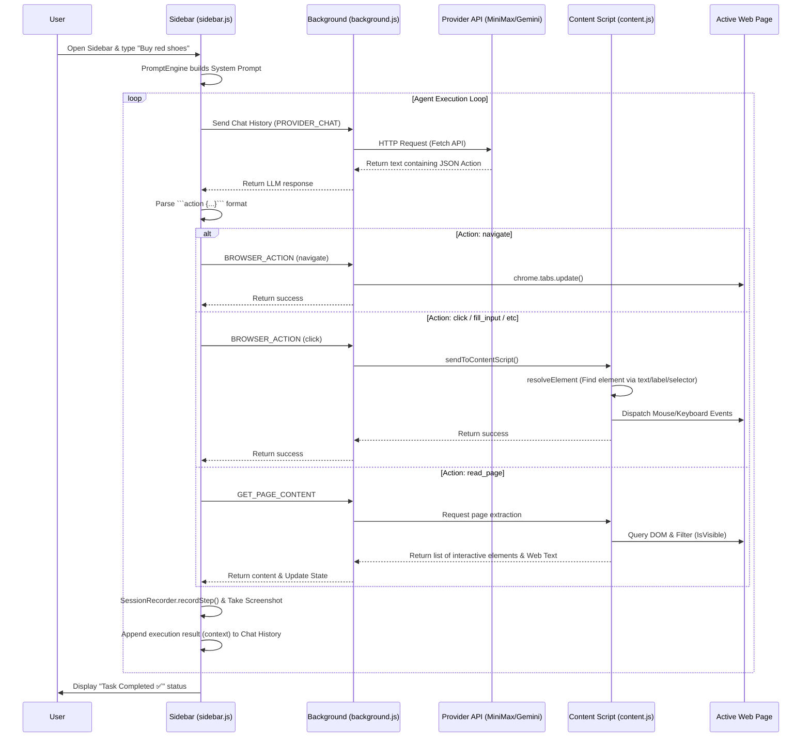

# Mini Browser Agent Architecture

This extension is built using the **Chrome Extension Manifest V3 (MV3)** specification. Unlike standard web applications, browser extensions have multiple execution contexts ("worlds") that run in isolation and must communicate with each other via message passing.

Here is a high-level overview of how the architecture works:

---

## 1. Core Components

The application is divided into three main layers:

### 🎭 **Sidebar (`sidebar.html` & `sidebar.js`)**
Acts as the **"Brain" & User Interface**.
- **Agent Loop**: Contains the `runAgentLoop` that runs continuously until the AI returns a `done` action or hits an error/step limit.
- **Prompt Engine**: Uses `prompt-engine.js` and `tools-registry.js` to compile the system prompt, giving the AI its personality and the list of available tools.
- **Session Recorder**: Logs every step the AI takes along with UI screenshots to be exported later into a `.zip` report.

### 🛡️ **Background Worker (`background.js`)**
Acts as the **"Network Router" & API Gateway**.
- Bridges messages (`chrome.runtime.sendMessage`) between the *Sidebar* and the *Content Script*.
- Handles external communications to the LLM servers (MiniMax/Gemini) via the `providers/` module. We do this in the background because MV3 prohibits complex CORS API injections and storing *Secret Keys* securely inside Content Scripts is unsafe.
- Manages specific browser-level APIs such as `chrome.tabs` (tab navigation), `chrome.tabs.captureVisibleTab` (taking screenshots), and downloads.

### 🕸️ **Content Script (`content.js`)**
Acts as the **"Eyes and Hands" (DOM Manipulator)**.
- This script is injected directly into the active web page (e.g., LinkedIn, Google).
- **Eyes (`GET_PAGE_CONTENT`)**: Scans the HTML structure. It only targets relevant interactive elements (like text paragraphs, buttons, forms, links) and **ignores** hidden elements (like `display: none`). It then assigns a numerical ID (*Label*) to each element.
- **Hands (`execute action`)**: Physically interacts with the page by simulating real user inputs, such as typing on the keyboard, scrolling, and dispatching *Mouse Click* events.

## 2. How the AI "Sees" the Screen

1. **DOM Extraction:** The AI does not actually "see" the visual image of the web UI. Instead, the *Content Script* extracts the web page into a readable, representative text format.
   *Example of what the AI sees:* `[12] button "Send Message"`
2. **Prompt Calculation:** The Sidebar injects this extracted screen text into the hidden System Prompt.
3. **Action Decision:** The AI reads the textual representation of the screen and is instructed to respond strictly with a JSON object (e.g., `{"type": "click", "label": 12}`).
4. **Execution:** The Sidebar parses the JSON from the AI's response and commands the Content Script to click the button labeled "12".

## 3. Security Hardening

- **Strict Prompting:** `tools-registry.js` strictly forbids the AI from hallucinating formats or providing any action outside the allowed JSON inside a markdown block.
- **Fallback Parser:** If the AI stumbles and uses the incorrect `[TOOL_CALL]` format, `prompt-engine.js` uses a resilient fallback regex parser to seamlessly fix it in memory without causing workflow errors.
- **Safe Dispatch:** All clicks and typing inputs are sent using native Chrome DOM Event dispatches (`MouseEvent`, `KeyboardEvent`), strictly avoiding `eval()` or `innerHTML` injections to prevent XSS (Cross-Site Scripting) attacks.
